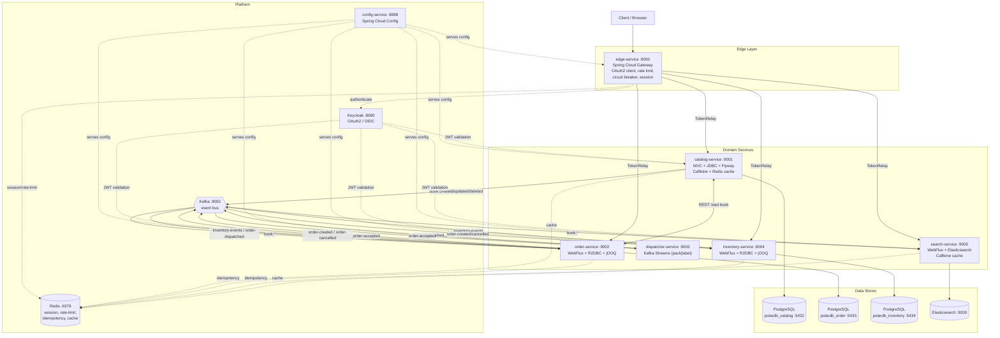

# System Architecture

Spring Native Bookstore is a microservices system (Spring Boot 4.0.3, Java 21, hexagonal
architecture). Clients reach the system through the Edge gateway. Domain services communicate
synchronously over REST and asynchronously over Kafka. Each stateful service owns its data store.

## Component responsibilities

| Service | Port | Role | Storage | Sync API | Async (Kafka) |
|---------|------|------|---------|----------|---------------|
| config-service | 8888 | Centralized config | Git/filesystem `config/` | serves config | — |
| edge-service | 9000 | API gateway, auth, resilience | Redis (session) | routes to all | config bus |
| catalog-service | 9001 | Book catalog CRUD | PostgreSQL + Caffeine/Redis | `/books` | produces `book.*` |
| order-service | 9002 | Order lifecycle / saga orchestration | PostgreSQL + Redis | `/orders` | produces order events, consumes inventory + dispatch + book events |
| inventory-service | 9004 | Stock reservation / release | PostgreSQL + Redis | `/inventory` | consumes order events, produces `inventory-events` |
| dispatcher-service | 9003 | Pack & label dispatch | — (stateless stream) | — | consumes `order-accepted`, produces `order-dispatched` |
| search-service | 9005 | Full-text book search | Elasticsearch + Caffeine | `/search` | consumes `book.*` |

## Cross-cutting concerns

- **Authentication**: Keycloak issues JWTs. `edge-service` is the OAuth2 client (authorization-code
  flow) and relays bearer tokens downstream (`TokenRelay`). Domain services act as resource servers
  validating the JWT.
- **Configuration**: All services pull configuration from `config-service` at startup.
- **Resilience** (edge): per-route circuit breakers with fallbacks, retries, and a Redis-backed
  rate limiter keyed by user.
- **Observability**: Actuator + Micrometer + OpenTelemetry export to the Prometheus/Grafana/Tempo/Loki
  stack.
