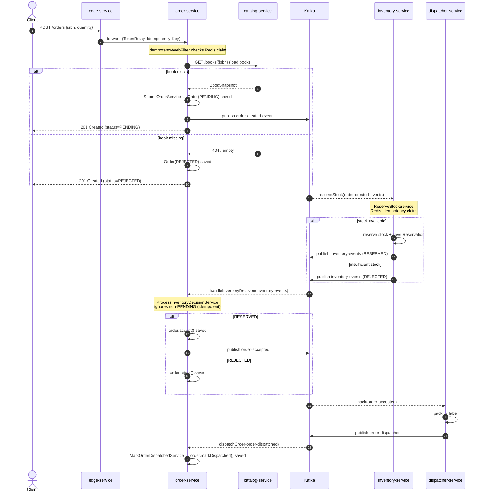
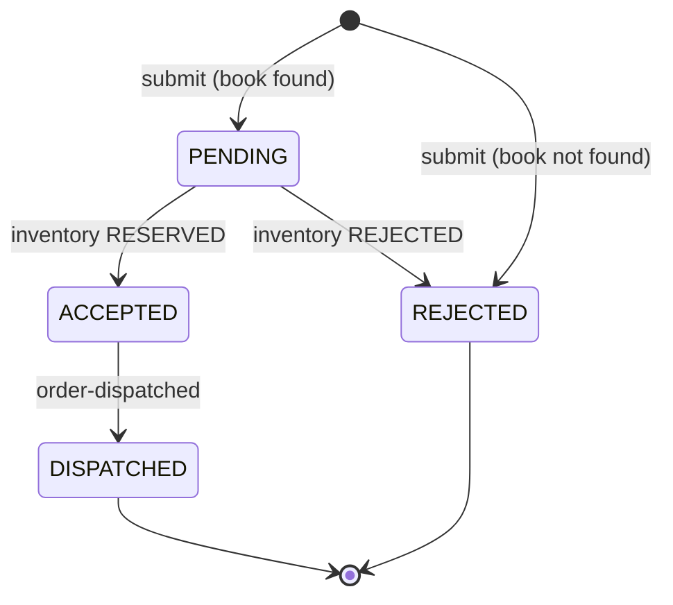

# Business Flow: Order Saga (happy path + rejection)

This is the core distributed transaction. An order is submitted synchronously, then a choreographed
saga across order → inventory → dispatcher coordinates stock reservation and fulfillment over Kafka.

## Sequence

## State machine (Order)

## Kafka topics in this flow

| Topic | Producer | Consumer | Binding (function) |
|-------|----------|----------|--------------------|
| `order-created-events` | order-service | inventory-service | `reserveStock-in-0` |
| `inventory-events` | inventory-service | order-service | `handleInventoryDecision-in-0` |
| `order-accepted` | order-service | dispatcher-service | `pack` |
| `order-dispatched` | dispatcher-service | order-service | `dispatchOrder-in-0` |

## Idempotency & resilience notes

- **HTTP idempotency** (order-service `IdempotencyWebFilter`): a client `Idempotency-Key` is claimed
  in Redis (`setIfAbsent`). Duplicate POSTs replay the cached response instead of re-creating an order.
- **Reservation idempotency** (inventory-service `ReserveStockService`): the order id is claimed in
  Redis; a duplicate `order-created` event short-circuits to a `RESERVED` decision. The DB unique
  constraint on reservations is the backstop (`DataIntegrityViolationException` → treated as reserved).
- **Optimistic locking**: `reserveStock` retries up to 3× with backoff on
  `OptimisticLockingFailureException` (concurrent stock updates).
- **Duplicate decisions**: `ProcessInventoryDecisionService` ignores decisions for orders not in
  `PENDING`, making the inventory→order step idempotent.
