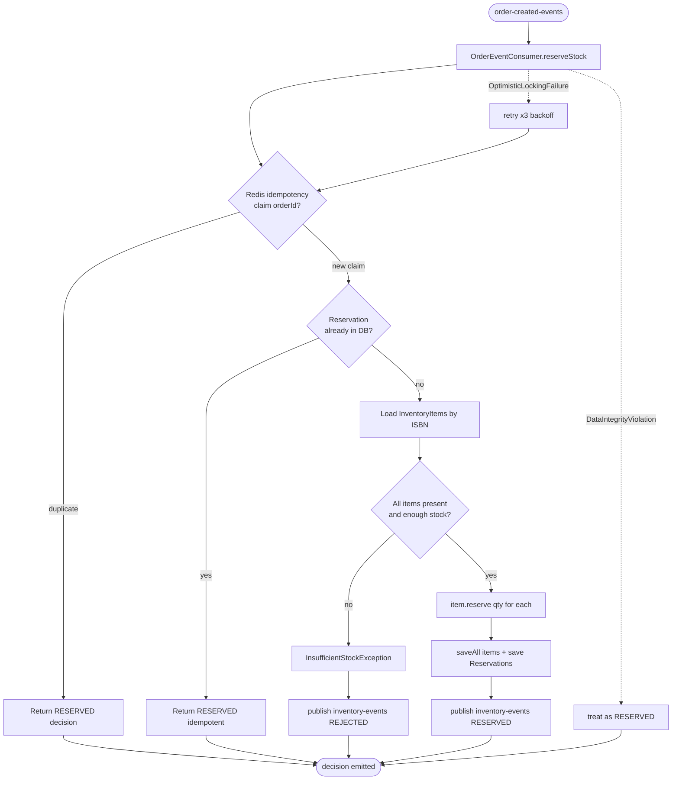
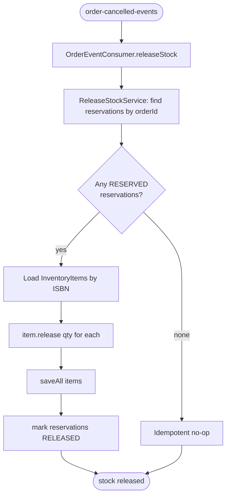
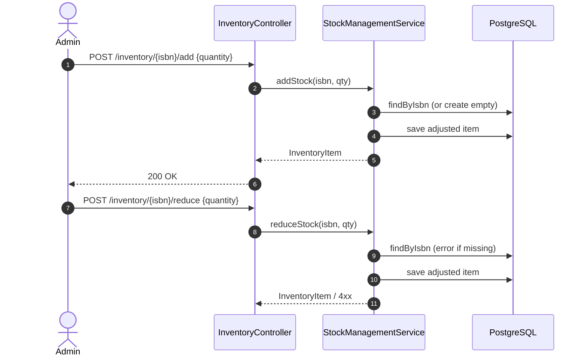

# Business Flow: Inventory Reservation & Release

The inventory-service is event-driven. It consumes order lifecycle events and adjusts stock,
emitting a decision back to the saga. It also exposes a small REST API for manual stock management.

## Reserve stock (consumes `order-created-events`)

## Release stock (consumes `order-cancelled-events`)

## Manual stock management (REST `/inventory`)

## Domain invariants (`InventoryItem`)

- `availableQuantity` and `reservedQuantity` never go negative.
- `reserve(qty)` moves stock from available → reserved (fails if insufficient).
- `release(qty)` moves stock from reserved → available.
- `adjust(delta)` changes available stock (manual add/reduce).
- Optimistic `version` guards concurrent updates.
