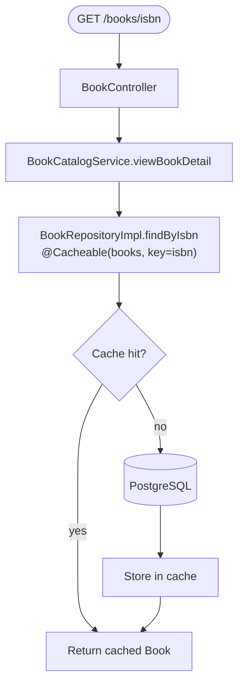
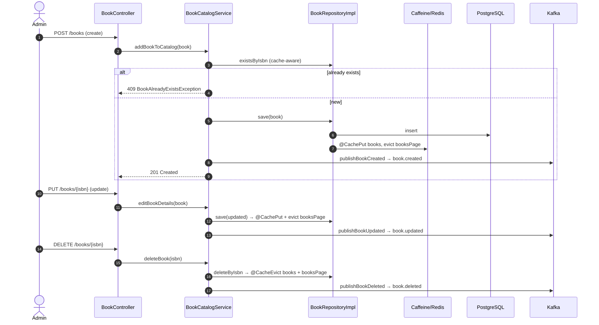
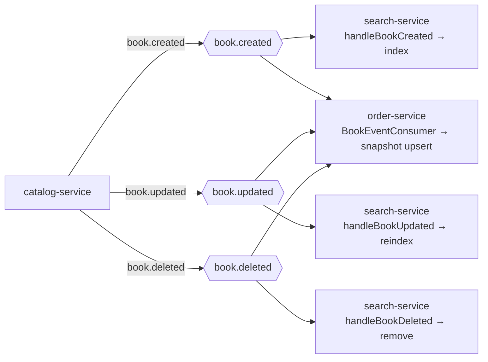

# Business Flow: Catalog CRUD, Caching & Event Publication

catalog-service is the source of truth for books. Reads are cached (Caffeine + Redis composite),
and every mutation publishes a `book.*` event that search-service and order-service consume.

## Read path with cache

The cache is a `CompositeCacheManager`: a local Caffeine layer (`books`, `booksPage`,
10 min TTL, max 10k) backed by a Redis layer (10 min TTL, `booksPage` 2 min TTL).

## Write path with cache eviction + event

## Event fan-out (`book.*`)

## Cache annotations (`BookRepositoryImpl`)

| Method | Annotation | Effect |
|--------|-----------|--------|
| `findByIsbn` | `@Cacheable(books, key=#isbn)` | cache single book |
| `findAll` | `@Cacheable(booksPage, key=methodName)` | cache list page |
| `save` | `@CachePut(books) + @CacheEvict(booksPage)` | refresh book, drop stale list |
| `deleteByIsbn` | `@CacheEvict(books + booksPage)` | drop book + list |
| `existsByIsbn` | manual cache lookup, DB fallback | fast existence check |
