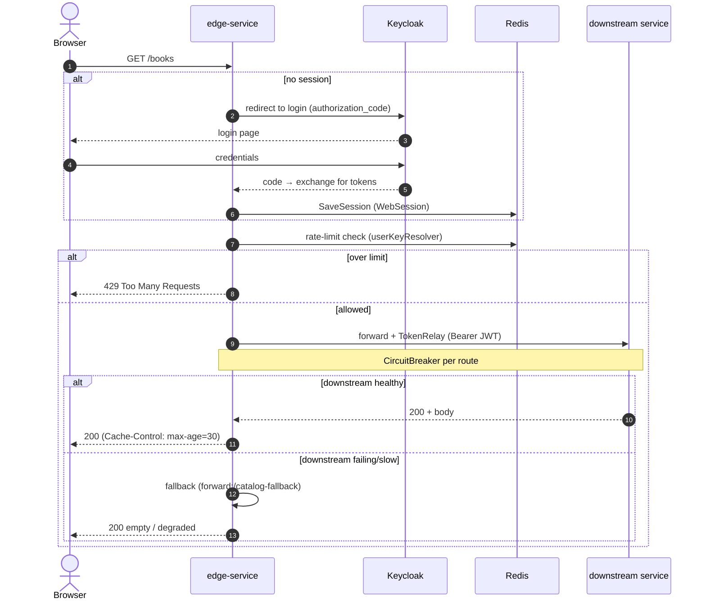
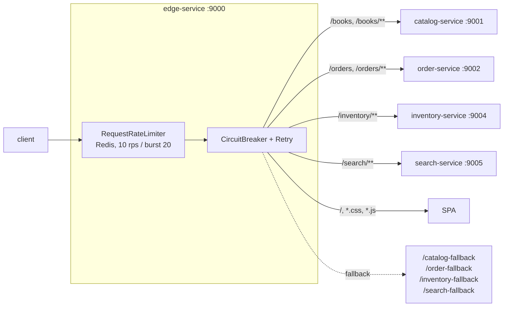

# Business Flow: Edge Routing, Auth & Resilience

edge-service is the single entry point. It authenticates users via Keycloak (OAuth2 authorization
code), stores the session in Redis, relays the access token downstream, and protects each route with
a circuit breaker, retries, and a per-user rate limiter.

## Authenticated request

## Routes & resilience

## Mechanisms

| Concern | Mechanism | Config |
|---------|-----------|--------|
| AuthN | OAuth2 login (Keycloak), `TokenRelay` | `edge-service.yml` |
| Session | Spring Session in Redis (`polar:edge`, 7d) | `spring.session` |
| Rate limit | Redis RequestRateLimiter keyed by user | 10 rps, burst 20 |
| Circuit breaker | Resilience4j per route | sliding window 20, 50% threshold |
| Retry | GET only, 3 attempts, exp backoff | `default-filters` |
| Caching hint | `Cache-Control: max-age=30` on catalog & search | `SetResponseHeader` |

> Note: downstream domain services act as OAuth2 **resource servers** — they independently validate
> the relayed JWT against Keycloak, so security is not solely enforced at the edge.
