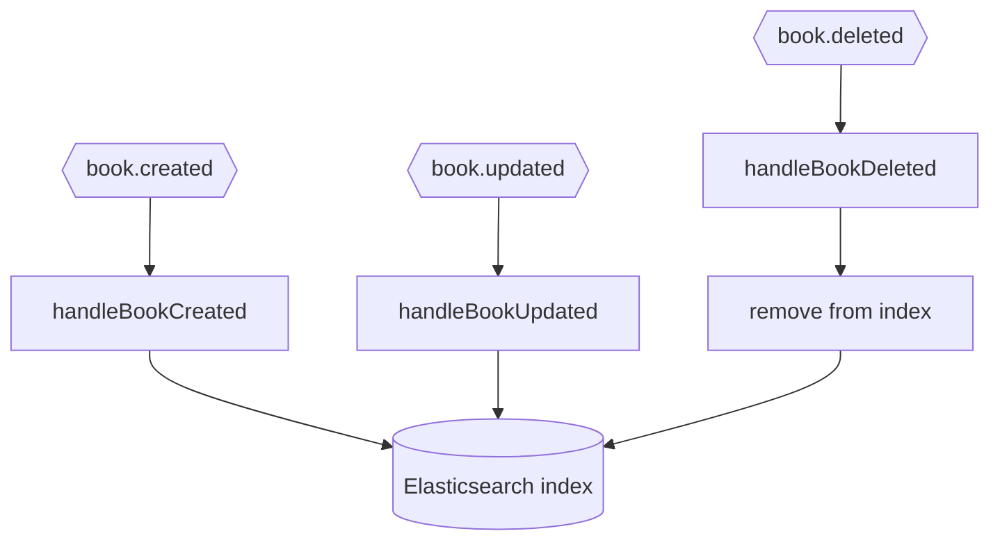
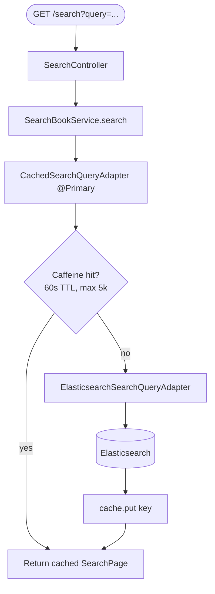

# Business Flow: Search Indexing & Query

search-service keeps an Elasticsearch index in sync with the catalog via `book.*` events, and serves
cached full-text queries. The cache layer is a Caffeine-backed `@Primary` decorator over the
Elasticsearch adapter.

## Index sync (consumes `book.*`)

## Query path with cache decorator

## Query types

`CachedSearchQueryAdapter` decorates every query method:

| Method | Cache key prefix |
|--------|------------------|
| `searchByTitle` | `search:title:` |
| `searchByAuthor` | `search:author:` |
| `searchByPublisher` | `search:publisher:` |
| `searchByIsbn` | `search:isbn:` |
| `searchAll` | `search:all:` |
| `suggestByTitle` | `suggest:title:` |
| `suggestByAuthor` | `suggest:author:` |

Keys include page number and size so paginated results are cached independently. Suggestion fluxes
are cached with `.cache()` so the upstream ES call is shared across subscribers.
