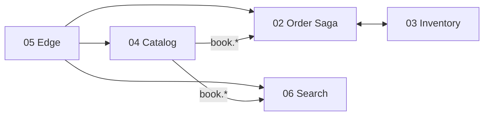

# Diagrams

Architecture and business-flow diagrams for the Spring Native Bookstore. All diagrams use
[Mermaid](https://mermaid.js.org/) and render directly on GitHub or any Mermaid-aware viewer.

| # | Diagram | What it covers |
|---|---------|----------------|
| 01 | [System Architecture](01-system-architecture.md) | All 7 services, data stores, REST + Kafka + Redis wiring, cross-cutting concerns |
| 02 | [Order Saga Flow](02-order-saga-flow.md) | End-to-end order lifecycle saga, state machine, topics, idempotency |
| 03 | [Inventory Flow](03-inventory-flow.md) | Stock reservation, release, manual management, domain invariants |
| 04 | [Catalog Cache Flow](04-catalog-cache-flow.md) | Book CRUD, Caffeine/Redis caching, `book.*` event fan-out |
| 05 | [Edge Routing Flow](05-edge-routing-flow.md) | Gateway auth (Keycloak), session, rate limit, circuit breaker, routes |
| 06 | [Search Flow](06-search-flow.md) | Elasticsearch index sync and cached query path |

## How the flows connect

## Conventions

- Solid arrows = synchronous calls (REST) or event production/consumption.
- Dotted arrows = supporting/infrastructure interactions (cache, config, auth).
- `{{...}}` nodes are Kafka topics; cylinder nodes are data stores.
