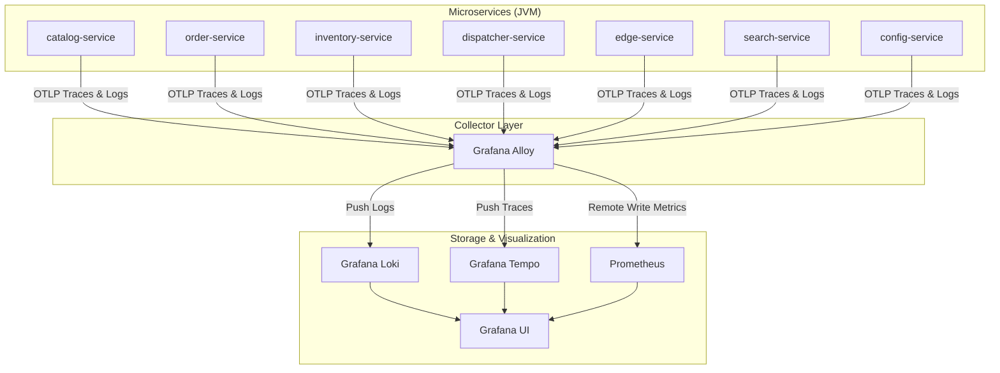

# Bookstore Observability Developer Guide

This guide details the microservice bookstore's native observability architecture. The older byte-code manipulation Java Agent and Fluent Bit setups have been replaced with in-process, compile-time telemetry instrumentation and a centralized Grafana Alloy collector.

---

## 1. Architecture Overview



Every service uses native `spring-boot-starter-opentelemetry` and the Logback `OpenTelemetryAppender` to export structured telemetry directly to the central **Grafana Alloy** collector via OTLP over HTTP/protobuf on port `4318`.

---

## 2. Structured Logs and Context Propagation

### Production Logging
In production (`prod` profile active), standard console strings are replaced with a machine-readable format.
Logs are forwarded in OTLP format to **Grafana Loki** via **Grafana Alloy**, preserving all MDC context fields like `trace_id` and `span_id` as metadata keys.

### Business Context (MDC)
- **MVC Services (`catalog-service`):** A custom `MdcRequestFilter` captures the authenticated Keycloak user ID and puts it into MDC (`userId`). Inside controllers, identifiers like `isbn` are bound within `try-finally` blocks.
- **WebFlux Services (`order-service`, `inventory-service`, `search-service`):** Logging statements use the SLF4J 2.0 Fluent API `addKeyValue(...)` which serializes attributes like `orderId`, `isbn`, and `query` without blocking the reactive schedulers.
- **Reactive Context Propagation:** Enabled automatically inside reactor operators via `Hooks.enableAutomaticContextPropagation()`.

---

## 3. How to Navigate: Logs to Traces

1. Open Grafana at [http://localhost:3000](http://localhost:3000).
2. Go to the **Explore** tab and select **Loki** as the datasource.
3. Query logs for any service, e.g. `{container_name="order-service"}`.
4. Expand any log entry. You will see a clickable **TraceID** or **TraceID (JSON)** link.
5. Click it to open a split pane showing the complete distributed W3C trace span breakdown inside **Grafana Tempo**, tracking requests across queues and REST gateways seamlessly.

---

## 4. Local Execution & Verifications

To boot the entire infrastructure along with the observability suite:

```bash
# Start all platform components
docker compose -f polar-deployment/docker/docker-compose.yml up -d

# Verify Grafana Alloy collector is ready
curl http://localhost:12345/ready
```

To compile and check flawless formatting across all microservices:
```bash
./gradlew spotlessApply build -x test
```
