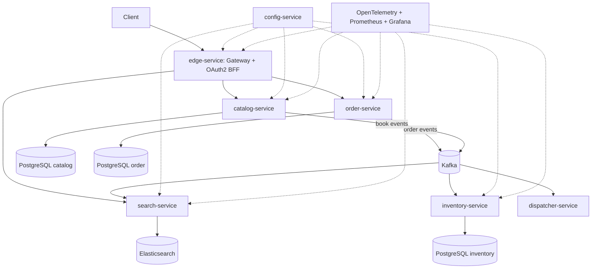

# Senior Roadmap — After Security

> Security phase is complete. The next work should move the bookstore from "secured microservices" to "production-grade distributed system": reliable events, observable behavior, resilient APIs, deployable infrastructure, and cloud-ready operations.

## Operating Rules

- Keep each phase small enough to verify locally.
- Prefer changing one service boundary at a time.
- Run the smallest useful Gradle check for touched services.
- Do not add cloud complexity before the local Kubernetes path works.
- Keep runtime values in `config/` or deployment manifests, not hardcoded in service code.

## Target Architecture



## Roadmap Overview

| Phase | Focus | Outcome |
|---|---|---|
| 4 | Production API patterns | Consistent errors, validation, logging, resilience |
| 5 | Reliable events | Outbox, idempotent consumers, saga compensation |
| 6 | Observability | Traces, metrics, dashboards, useful logs |
| 7 | Local Kubernetes + GitOps | Helm/Kustomize manifests managed by ArgoCD |
| 8 | Progressive delivery | Rollouts, health gates, rollback practice |
| 9 | AWS production path | EKS/ECR/RDS/MSK/OpenSearch plan and migration |

---

## Phase 4 — Production API Patterns

> Goal: make every service predictable under bad input, downstream failure, and operational debugging.

### 4.1 RFC 7807 Problem Details

- [ ] Audit current exception handling in `catalog-service`, `order-service`, `inventory-service`, and `search-service`.
- [ ] Standardize error responses with Spring Problem Details.
- [ ] Map validation failures to `400 Bad Request` with field-level errors.
- [ ] Map missing resources to `404 Not Found` consistently.
- [ ] Map business-rule conflicts to `409 Conflict`.

**Acceptance:** invalid create/update requests return the same response shape across services.

**Verify:**

```bash
cd catalog-service && ./gradlew test
cd order-service && ./gradlew test
```

### 4.2 Request Validation Hardening

- [ ] Review all request DTOs for missing Jakarta Validation annotations.
- [ ] Add validation tests for boundary values: empty ISBN, invalid quantity, negative price, invalid page size.
- [ ] Keep validation at API boundaries; keep business invariants in domain/application services.

### 4.3 Structured Logging

- [ ] Add JSON logging profile for local and container runtime.
- [ ] Include `traceId`, `spanId`, `userId`, `orderId`, and `isbn` when available.
- [ ] Avoid logging JWTs, session cookies, credentials, or raw PII.
- [ ] Add one log line per important state transition: order submitted, order accepted, stock reserved, dispatch requested.

### 4.4 Resilience4j Policies

- [ ] Add timeout, retry, and circuit breaker around gateway/downstream calls where useful.
- [ ] Keep retries only for idempotent operations.
- [ ] Add fallback behavior for read endpoints where stale/empty response is acceptable.
- [ ] Expose circuit breaker metrics through Actuator.

### 4.5 API Contract Checks

- [ ] Document public endpoints for edge, catalog, order, inventory, and search.
- [ ] Add contract tests for edge-service routing to downstream services.
- [ ] Add response-shape tests for consumer-sensitive endpoints.

---

## Phase 5 — Reliable Events And Distributed Consistency

> Goal: remove "dual write" risk and make event-driven flows safe to retry.

### 5.1 Outbox Pattern In `order-service`

- [ ] Create `outbox_events` migration in `order-service`.
- [ ] Save order state and outbox event in the same database transaction.
- [ ] Publish outbox events to Kafka with a scheduled publisher or Debezium-compatible table design.
- [ ] Mark published events without losing retry ability.
- [ ] Add tests for publish failure and retry.

**Acceptance:** if Kafka is down during order creation, the order and pending event remain in PostgreSQL and publish later.

### 5.2 Catalog Book Events

- [ ] Publish `book.created`, `book.updated`, and `book.deleted` through an outbox table instead of direct publish.
- [ ] Ensure event payloads contain enough data for `search-service` indexing.
- [ ] Add version or timestamp fields to support idempotent indexing.

### 5.3 Idempotent Consumers

- [ ] Add processed-event tracking for `inventory-service`.
- [ ] Add idempotency key handling for `search-service` indexing.
- [ ] Verify duplicate Kafka messages do not reserve stock twice or create duplicate documents.

### 5.4 Saga Choreography For Orders

- [ ] Define order states: `SUBMITTED`, `ACCEPTED`, `REJECTED`, `CANCELLED`, `DISPATCHED`.
- [ ] Define events: `order.submitted`, `order.accepted`, `order.rejected`, `stock.reserved`, `stock.rejected`, `order.dispatched`.
- [ ] Implement compensation: stock rejection cancels or rejects the order.
- [ ] Add integration tests for happy path and compensation path.

### 5.5 Dispatcher Flow

- [ ] Make `dispatcher-service` consume only accepted/ready-to-dispatch orders.
- [ ] Keep dispatch idempotent by order ID.
- [ ] Emit `order.dispatched` after successful dispatch simulation.

---

## Phase 6 — Observability

> Goal: answer "what happened to this request/order?" without attaching a debugger.

### 6.1 Distributed Tracing

- [ ] Add OpenTelemetry instrumentation for HTTP, database, Kafka, and gateway flows.
- [ ] Propagate trace context through Kafka headers.
- [ ] Run local collector with Grafana Tempo or Jaeger.
- [ ] Verify one trace covers edge request, order creation, Kafka event, inventory reservation, and dispatcher action.

### 6.2 Metrics

- [ ] Expose Micrometer metrics for all services.
- [ ] Add custom counters: orders submitted, orders rejected, stock reservations failed, search indexing failures.
- [ ] Add timers for search latency and order submission latency.
- [ ] Add Prometheus scrape config in local deployment.

### 6.3 Dashboards

- [ ] Create Grafana dashboard for service health, latency, error rate, and Kafka lag.
- [ ] Create business dashboard for order count, rejection count, dispatch count, and search index failures.
- [ ] Add dashboard JSON under deployment or docs directory.

### 6.4 Alerts

- [ ] Define local alert rules for high error rate, Kafka consumer lag, database connection failures, and circuit breaker open state.
- [ ] Document how to test each alert locally.

---

## Phase 7 — Local Kubernetes And GitOps

> Goal: make local Kubernetes the rehearsal environment for production.

### 7.1 Deployment Manifests

- [ ] Create or update Kubernetes manifests for every service.
- [ ] Add ConfigMaps for non-secret config.
- [ ] Add Secrets only as local placeholders; do not commit real credentials.
- [ ] Add readiness and liveness probes for every HTTP service.
- [ ] Add resource requests and limits.

### 7.2 Helm Or Kustomize

- [ ] Choose one packaging path: Helm for template-heavy deployments or Kustomize for simpler overlays.
- [ ] Create `local`, `staging`, and `production` values or overlays.
- [ ] Keep image repository and tag configurable.

### 7.3 ArgoCD Local

- [ ] Install ArgoCD in local cluster.
- [ ] Add one Application per service or one app-of-apps root.
- [ ] Enable auto-sync for local only.
- [ ] Verify drift correction by manually changing a replica count and letting ArgoCD restore it.

### 7.4 CI Image Pipeline

- [ ] Align GitHub Actions with service boundaries.
- [ ] Build images with `bootBuildImage` or Dockerfiles consistently.
- [ ] Push images with immutable tags based on commit SHA.
- [ ] Update GitOps manifests with the new image tag.

---

## Phase 8 — Progressive Delivery And Runtime Safety

> Goal: practice safe deploys before touching AWS.

### 8.1 Argo Rollouts

- [ ] Add Rollout resource for `catalog-service` or `edge-service` first.
- [ ] Configure canary steps: 10%, 50%, 100%.
- [ ] Add metric-based promotion using error rate or success rate.
- [ ] Practice rollback by deploying a deliberately broken version locally.

### 8.2 Database Migration Safety

- [ ] Document expand-and-contract migration strategy.
- [ ] Add checks that Flyway migrations run before app readiness.
- [ ] Practice a backward-compatible schema change.
- [ ] Avoid editing historical migrations.

### 8.3 Load And Failure Testing

- [ ] Add a small load-test script for browse, search, and order flows.
- [ ] Kill Kafka, PostgreSQL, and one service during a test and document behavior.
- [ ] Verify retry, circuit breaker, outbox, and idempotency behavior under failure.

---

## Phase 9 — AWS Production Path

> Goal: migrate the proven local platform to AWS with managed services.

### 9.1 AWS Foundation

- [ ] Create ECR repositories for service images.
- [ ] Create EKS cluster with `eksctl` or Terraform.
- [ ] Install AWS Load Balancer Controller.
- [ ] Configure Route53 and ACM for TLS.

### 9.2 Managed Data Services

- [ ] Move PostgreSQL workloads to RDS PostgreSQL.
- [ ] Move Kafka workloads to MSK.
- [ ] Move Redis to ElastiCache.
- [ ] Move Elasticsearch to Amazon OpenSearch Service.
- [ ] Decide where Keycloak runs: EKS with RDS backend, or managed identity alternative.

### 9.3 Cloud GitOps

- [ ] Install ArgoCD on EKS.
- [ ] Split staging and production namespaces.
- [ ] Use manual promotion for production.
- [ ] Store secrets with External Secrets Operator or Sealed Secrets.
- [ ] Verify rollback from Git revert.

### 9.4 Production Hardening

- [ ] Add network policies.
- [ ] Add pod disruption budgets.
- [ ] Add horizontal pod autoscaling.
- [ ] Add backup and restore procedure for databases.
- [ ] Add runbooks for common incidents.

---

## Suggested Immediate Next Sprint

1. Implement RFC 7807 Problem Details in `catalog-service` and `order-service`.
2. Add structured JSON logging with trace fields.
3. Add `order-service` outbox table and publish retry loop.
4. Add idempotency tests for inventory reservation.
5. Add a local observability compose profile with Prometheus and Grafana.

## Definition Of Done For The Next Phase

- All touched services pass `./gradlew test`.
- Error responses are consistent for validation, not found, and conflict cases.
- Logs contain correlation fields and no secrets.
- At least one event flow survives Kafka downtime through the outbox.
- At least one distributed trace shows a full order flow.
- The roadmap stays current as phases are completed.

## Reference Reading

- `tasks/technology.md` — production patterns and implementation references.
- `tasks/new-technology.md` — deeper study modules.
- Cloud Native Spring in Action — deployment, security, and cloud native patterns.
- Designing Data-Intensive Applications — reliability, streams, consistency.
- Release It! — resilience, stability patterns, production failure modes.
- Site Reliability Engineering — observability, alerting, incident response.
